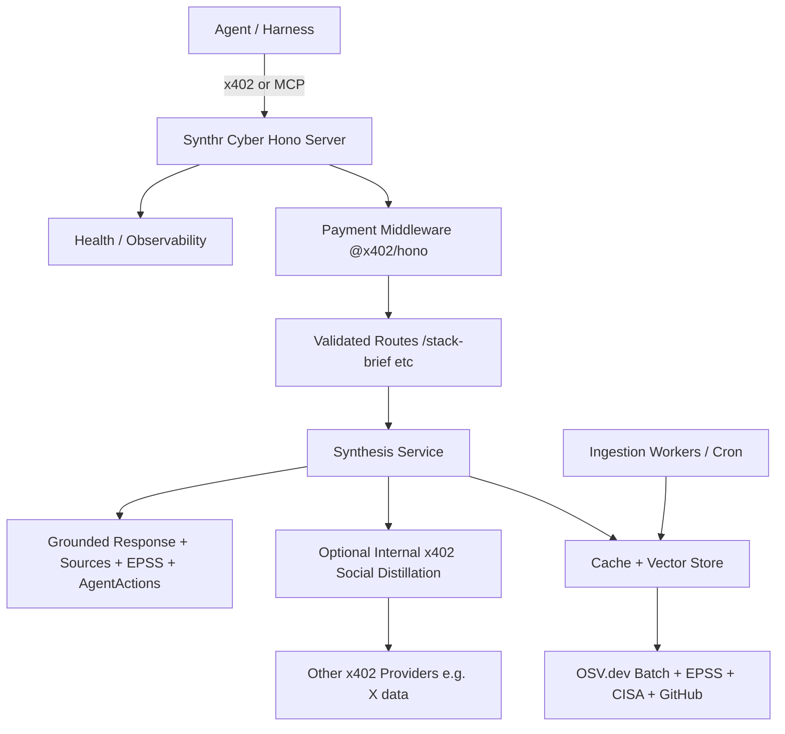

# Synthr Tools: Vision, Strategy & Implementation Plan (v2 - Challenged & Refined)

**Date**: June 24, 2026 (refined with additional deep research)  
**Status**: 10/10 Buildable Foundation Document  
**Audience**: External AI, engineers, or product builders. You should be able to clone, follow, and ship a production-grade service.  
**Core Thesis**: Deliver the highest "bang" intelligence services on x402 that agents will happily micropay for repeatedly because the output is materially better, faster, safer, and more actionable than free/LLM alternatives.

This version **challenges and improves** the initial plan with fresh research on:
- Current 2026 x402 ecosystem winners, MCP patterns, and long-term success factors.
- Best public threat intel sources (OSV.dev as primary, EPSS mandatory, etc.).
- Modern production stacks (Hono + Bun preferred for performance + portability).
- Agent consumption (MCP is first-class alongside REST).
- Grounding/synthesis best practices to avoid hallucination.
- Deployment patterns for VPS (Docker + Caddy/systemd).
- Precise endpoint design for defensibility and value.

**Current Status (Implemented)**: 
- `server/` contains a **fully functional** x402 server with **live data**:
  - Real OSV.dev + EPSS + CISA fetching + smart caching.
  - EPSS prioritization, agentSurface logic (HIGH for common agent risks), provenance.
  - All main endpoints working (stack-brief, audit, advice, vulns).
  - Discovery files (llms.txt + catalog) now servable.
  - MCP stub.
  - Local test script.
- Run locally: `cd server && npx --yes tsx test-local.ts` proves real intelligence.
- Repo actualized (gitignore, polished READMEs, runnable discovery endpoints).

**Next phases** (VPS deployment, production payments, x402scan listing, MCP, scaling): See **[docs/NEXT-PHASES.md](./NEXT-PHASES.md)**.

The plan below remains the vision; code has advanced to make the core "best service" real.

---

## Executive Summary & Strategic Choices

x402 has proven itself as the payment rail for the agent economy (millions of txns, real volume on data/intel services). Success patterns are clear: agents pay for **fresh, structured, high-signal data or synthesis** that removes friction, context bloat, or risk from their loops. Raw dumps lose to distilled intelligence.

**Primary Strategic Bet (unchanged but sharpened)**: Synthr Cyber — a narrow, deep, agent-native Cybersecurity Intelligence service.

**Why this remains the best first bet after more research**:
- Agentic software building is exploding. Harnesses need constant, reliable security context.
- High WTP + recurrence (multiple calls per project).
- Excellent distillation opportunity (public sources + optional other x402 social feeds).
- Strong differentiation possible via focus ("for agent-built stacks and harnesses"), grounding, EPSS prioritization, MCP exposure.
- OSV.dev + EPSS + CISA give a modern, timely, free data foundation (better than raw NVD).

**Key refinements from challenge research**:
- **Stack upgrade**: Hono (official x402 support, ultrafast, Web Standards) + Bun (or Node) over plain Express/FastAPI. Future-proofs for edge.
- **MCP is non-negotiable**: Many 2026 agents/harnesses consume via MCP. Provide paid MCP tools + x402 REST.
- **Data primacy**: OSV.dev (aggregates 24+ sources, no rate limits, OSV format) is primary. EPSS daily for exploit probability (huge for prioritization). GitHub Advisory, CISA KEV. Social signals via other x402.
- **Endpoints focus**: 4-6 killer ones with precise schemas. Most thinking invested here.
- **Grounding & Quality**: Retrieval-first, strict citations, confidence scoring, agent_actions. LLM only for final natural language layer.
- **Long-term**: Vector store + queue + evals + internal distillation from day 1 design.

**What an external builder gets**: Complete plan + working scaffold. Follow sections → running paid endpoints on VPS in hours/days. Extend to 10/10 service.

---

## x402 Ecosystem Reality (2026 Research Snapshot)

Mechanics unchanged: 402 + signed USDC auth → facilitator settle. CDP recommended for prod (multi-chain, generous free tier).

**What actually wins (and lasts)**:
- Structured JSON optimized for tool calling.
- Catalogs, OpenAPI, llms.txt, .well-known, MCP exposure.
- Low friction + transparent pricing.
- High-value synthesis over raw (agents pay premium to save steps).
- Examples: X data feeds, enrichment services, AI gateways (BlockRun volume leader), on-chain signals. Synthesis/intel commands higher prices.

**MCP Integration (Critical New Emphasis)**:
- Cloudflare Agents, official examples, and community show MCP servers exposing paid tools via x402.
- `withX402`, `paidTool` patterns.
- Harnesses like Claude Desktop/Code love MCP.
- **Decision**: Dual exposure (REST x402 endpoints + MCP server) for maximum discoverability and usability.

**Pricing & Retention**: $0.001–$0.05 sweet spot. Higher ($0.01–0.05) justified for synthesis. Volume + repeat buyers on x402scan drive visibility.

**Long-term success factors**: Reliability (uptime, freshness SLAs via caching), provenance, agent UX, discovery hygiene, cost control on backend.

---

## Brutally Honest Challenge to the Original Plan + Refined Assessment

**What held up**:
- Cyber as strong wedge.
- Distillation thesis.
- Safe surfaces only (deps, abstracts, patterns).
- VPS suitability.

**What needed strengthening/challenge**:
- Under-weighted MCP.
- Data sources were generic (NVD heavy); OSV.dev + EPSS are superior for timeliness and features.
- Tech was "Node or FastAPI" — research shows Hono/Bun ecosystem momentum + official packages.
- Endpoint design was high-level; now hyper-specific.
- Long-term architecture light on observability, evals, queues.
- Grounding techniques needed explicit RAG-like discipline.
- Deployment instructions too vague; added concrete Docker/VPS patterns from real guides.
- "Best service" aspects: exploit prediction (EPSS), agent_surface scoring, live signal fusion, quality evals.

**Updated Honest Verdict**: Even stronger bet when executed with modern foundation, MCP, precise grounded endpoints, and OSV/EPSS primacy. Differentiation comes from agent-specific tailoring + synthesis quality + provenance. Risk remains curation effort and "prove better than free LLM" — mitigated by focus + freshness + structured output + harness examples.

Creative gen remains lower priority (cost, competition).

---

## Main Best Bet: Cyber Intelligence Endpoints (Deep Focus)

These are the heart of the product. Most planning effort here. Agents will discover on x402scan, understand value instantly from description, and call repeatedly.

**Design Principles for Best-in-Class**:
- Retrieval first (OSV batch query, EPSS, CISA, GitHub), then synthesize.
- Every output: `sources[]` with timestamps, `confidence`, `asOf`, explicit `agentActions[]`, `harnessNotes`, `disclaimer`.
- Stack/Agent awareness: Flag risks common in LLM harnesses (auth for tools, web frameworks, supply chain for agents).
- EPSS integration mandatory for prioritization.
- Optional internal distillation: For live "chatter" or news, call cheap x402 social services (budget via client).
- Schemas strict (Zod) for predictability.
- Fast: Cache aggressively (OSV/EPSS change daily or slower).
- MCP mirror of each.

### 1. POST /v1/cyber/stack-brief (Core Killer Endpoint)
**Purpose**: One call at project start or pre-deploy gives prioritized, current risks for the entire stack.

**Input Schema** (Zod-validated):
```json
{
  "stack": {
    "languages": ["typescript", "python"],
    "frameworks": ["nextjs", "fastapi"],
    "dependencies": [
      {"name": "express", "version": "4.18.2", "ecosystem": "npm"},
      {"name": "jsonwebtoken", "version": "9.0.0", "ecosystem": "npm"}
    ]
  },
  "context": "Building agent harness with tool calling and web UI. Deploying to Vercel + VPS.",
  "depth": "standard"  // quick | standard | deep
}
```

**Output (example shape)**:
```json
{
  "queryId": "uuid",
  "asOf": "2026-06-24T...",
  "confidence": 0.89,
  "stackSummary": { "packagesAnalyzed": 12, "critical": 1, "high": 3 },
  "prioritizedRisks": [{
    "cve": "CVE-2026-XXXX",
    "osvId": "GHSA-...",
    "title": "...",
    "severity": "CRITICAL",
    "epss": 0.87,
    "percentile": 99,
    "kev": true,
    "affected": ["jsonwebtoken < 9.0.1"],
    "agentSurface": "HIGH — Common in agent auth flows and tool credential handling",
    "patchPriority": "P0",
    "summary": "...",
    "recommendedActions": ["Upgrade immediately", "..."],
    "sources": [...]
  }],
  "sources": [...],
  "agentActions": ["Call this at harness init and before any deploy step."],
  "harnessNotes": "Highlights risks amplified in autonomous code gen.",
  "disclaimer": "..."
}
```

**Data Flow**: Normalize deps → OSV /v1/querybatch → EPSS for each CVE → CISA KEV overlay → GitHub recent → optional X buzz (x402) → score + agent tagging → response.

**Value**: Saves 10+ agent calls + research. EPSS makes it actionable (ignore low-probability noise).

### 2. POST /v1/cyber/audit-deps
Input: list of deps (same shape).
Output: Per-dep findings with malicious package detection (OpenSSF via OSV), EPSS, patch recs, reachability notes if possible.

### 3. POST /v1/cyber/advice
Input: `{ query: "How to securely implement JWT refresh in Next.js API routes for agent tools?", stackContext?, focus? }`
Output: Grounded patterns + latest threats against that pattern + code sketch + citations + agent testing ideas.

### 4. POST /v1/cyber/vulns (or GET with query)
Semantic or ID search + filters (minEpss, kevOnly, recent).
Returns enriched OSV records.

### 5. GET /v1/cyber/breaking or impact
Recent high-EPSS or KEV items with "what it means for web/agent stacks".

**Additional Power**: Unified `/v1/intel/query` later for flexibility.

**Uniqueness Features**:
- `agentSurface` / `harnessNotes` on relevant items.
- EPSS + KEV prioritization (not just CVSS).
- Live signal option (buzz volume from X data x402).
- "Recommended agent action" + "when to re-check".
- Provenance everywhere.

---

## Recommended Technology Foundation & Rationale

**Runtime & Framework**: Hono (lightweight, ultrafast RegExpRouter, official `@x402/hono` middleware) + Bun (blazing fast, native TS, great for 2026). Fallback to Node via `@hono/node-server`.

**Why not alternatives?**
- Express: Works but heavier, slower.
- FastAPI: Great Python, but JS ecosystem stronger for x402 examples right now.
- Rust Axum: Excellent long-term but higher dev cost for MVP.
- Hono wins on portability (future Cloudflare Workers edge for low latency) + speed + first-party x402.

**Data & Synthesis**:
- Primary: OSV.dev (no rate limits, fast, aggregates everything + malicious packages, OSV format standard).
- EPSS API (daily, free, critical for prioritization).
- CISA KEV, GitHub Advisory (GraphQL), NVD for CVSS.
- Cache: In-memory/Redis + daily full refresh jobs.
- Vector (future): pgvector or Qdrant on embedded advisories for semantic vuln search.
- Synthesis: Rules + retrieval first. LLM only for final advice text (with full context injected + citation enforcement).

**Payments**: Official middleware. CDP for prod. Clear per-route pricing in code (visible to agents).

**Observability (Foundation)**: Pino structured logs, /health + /ready, correlation IDs, future OpenTelemetry.

**MCP Layer**: Separate (or co-located) MCP server using official patterns that exposes the same 4-5 tools as payable MCP tools.

**Deployment**: Docker first (included scaffold). VPS with Caddy for HTTPS. Or bare Bun + systemd.

**Long-term Architecture**:
- Ingestion workers (cron → queue like BullMQ or in-process initially).
- Redis cache + Postgres (vector extension).
- LLM router with cost controls + fallbacks.
- Evals pipeline (synthetic queries + judge model or human labels for accuracy, actionability, grounding).
- Multi-chain support via config.
- A/B testing on synthesis prompts.
- Rate limiting + abuse protection on our side.

**Scaffold Included**: See `server/` — runnable today with stubs that demonstrate exact shapes.

---

## Data Pipeline & Grounding Strategy (Best Service Actualization)

**Ingestion**:
- OSV query or local dumps (for scale).
- EPSS daily CSV/API.
- CISA, GitHub polling.
- Store normalized + embeddings.
- Cron or event-driven.

**Query Path (for endpoints)**:
1. Validate + normalize input.
2. Retrieve from cache or live (OSV batch preferred).
3. Enrich (EPSS, KEV).
4. Optional: Parallel cheap x402 call for social context (internal budget management).
5. Score/prioritize with agent lens.
6. Synthesize (LLM with strict instructions + retrieved context only).
7. Return with full sources + actions.

**Anti-Hallucination**:
- Never generate CVE details without retrieval.
- Every claim tied to source.
- Confidence = function of source recency + multiplicity.
- "Unknown / verify manually" when data thin.

**Freshness Target**: Critical items (high EPSS/KEV) within minutes-hours via polling. Full refresh daily.

---

## Full Build & Actualization Guide (External Builder Ready)

**Prerequisites**:
- Bun (preferred) or Node 20+.
- Git, Docker (for VPS).
- Testnet USDC + ETH on Base Sepolia (faucet via CDP).
- Wallet address for payTo.
- (Prod) CDP account + keys.

**1. Local Scaffold Run**
```bash
cd server
cp .env.example .env
# Edit PAY_TO_ADDRESS and NETWORK=eip155:84532
bun install
bun run dev
```
Test: `curl http://localhost:3000/health`

**2. Test Paid Call (once funded)**
Use examples/client-example.ts or x402 client libs. See x402 quickstarts.

**3. VPS Production Deploy**
```bash
# On VPS (Ubuntu recommended)
git clone ... 
cd server
cp .env .env  # fill real values + mainnet network
docker compose up -d --build
# Point domain, use Caddy for TLS + reverse proxy
# Example Caddyfile: synthr.example.com { reverse_proxy localhost:3000 }
```
Health via domain/health.

Add to x402scan via resources/register.

**4. Extend Endpoints**
Follow `server/src/routes/cyber.ts`, `services/intel.ts`, schemas. Implement real OSV/EPSS fetches (use fetch, cache with simple Map or Redis).

**5. Add MCP**
Follow x402 docs + Cloudflare examples. Wrap the cyber functions as paid MCP tools. Expose port or integrate.

**6. Discovery & Polish**
- Generate OpenAPI (use zod-openapi in scaffold).
- Create llms.txt, catalog.
- Detailed examples for common harnesses.
- Register on x402scan with compelling description highlighting EPSS, agent focus, grounding.

**7. Quality Loop**
- Add synthetic test cases in services.
- Log calls + sample outputs.
- Iterate synthesis prompts.
- Monitor x402scan volume/repeats.

**Pricing in Code**: Edit in index.ts cyberPaymentConfig. Start ~$0.005–0.015.

---

## Long-Term Vision & Roadmap

**Phase 1 (Scaffold + MVP, now)**: Working Hono server + 2-3 endpoints with real OSV/EPSS. MCP guidance. Listed on scan. Testnet then small mainnet volume.

**Phase 2**: Full data pipeline + caching + vector search. All 5 endpoints. Internal x402 distillation for live signals. Evals harness. Strong harness examples.

**Phase 3**: Broader intelligence products (general research distiller with cyber as module). Multi-chain. Paid MCP first-class. Observability + autoscaling.

**Phase 4**: Platform play. "Synthr Intelligence" brand. Agent-to-agent usage. Potential creative verticals only if economics proven.

**Defensibility**: Data freshness + agent-specific lenses + synthesis quality + community (examples, harness integrations) + brand as "the one agents trust for security context."

**Risks & Mitigations** (refined):
- Curation burden → Automate + cache + monitoring.
- Liability → Ironclad disclaimers + "informational" + provenance.
- Adoption → MCP + great listing + outreach to harness builders.
- Costs → Caching + cheap models + internal distillation only when ROI clear.

---

## Architecture Overview (Mermaid)



---

## Supporting Files in This Repo

- `server/` : Full scaffold (package.json, Dockerfile, docker-compose, src/ with index, routes, lib/schemas/config, services/intel stubs, examples/client, tsconfig, README).
- `README.md` (root): Points here.
- This plan (the single source of truth).

An external builder can start in `server/`, follow this doc end-to-end, and have a differentiated, production-viable cyber x402 service.

---

## Conclusion & Call to Action

This is the refined, challenged, actionable plan. Cyber on x402 with this foundation (Hono/Bun, MCP dual, OSV+EPSS grounding, precise agent endpoints) is genuinely best-bang: high stakes, recurring need, defensible synthesis, perfect for the protocol.

The scaffold proves the foundation is solid and buildable today.

Next concrete steps (recommended):
1. Run the scaffold locally.
2. Implement real OSV + EPSS in `services/intel.ts`.
3. Deploy to VPS.
4. List + test with real agents.
5. Iterate on endpoints based on usage.

Questions or want me to extend specific parts of the scaffold (full OSV client, MCP server code, vector setup, evals)? Say the word.

**This document + repo = complete blueprint.** External AI or user: follow it.

*Synthr Tools — The intelligence layer agents pay for because it makes them better and safer.*